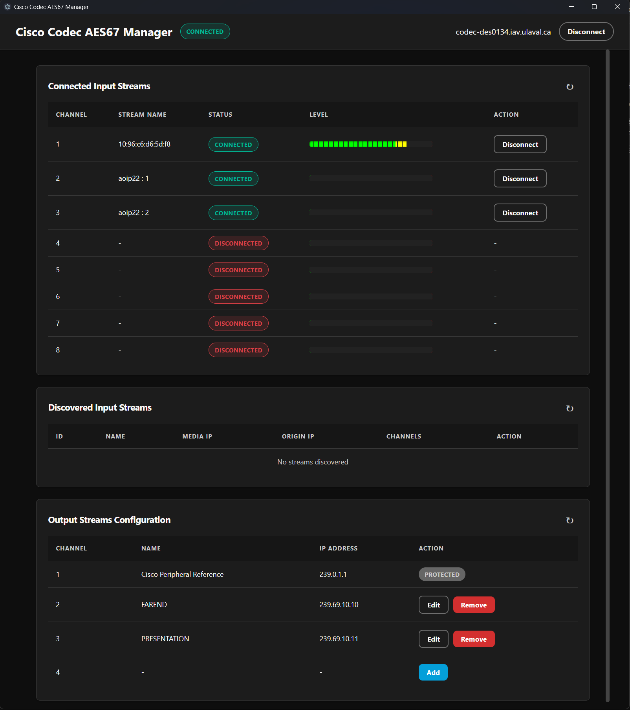

# Cisco Codec AES67 Manager

A cross-platform standalone application built to help configure, monitor, and manage AES67 streams natively on Cisco Collaboration Codecs using the XAPI.

## Features
- **Instant Connection Validation**: Validates codec readiness immediately upon login (enforcing SAP Discovery Mode and strict Encryption rules necessary for standard AES67 interaction).
- **Stream Discovery**: Automatically tracks and lists inbound connected sources.
- **Output Management**: Setup new AES67 output streams straight from your device, with integrated guard rails keeping network IPs inside the standardized `239.69.x.x` ranges.
- **Smart Channel Mapper**: Quickly bind incoming streams to your choice of available local channels using the visual assignment picker (channels already in use are clearly blocked so you don't over-write critical lines!).
- **VU Meters**: Features segmented visualization to give real-time volume unit readouts right from the codec interface before internal AEC logic gets applied. No acoustic echo calculation interfering with your raw level mapping.

## License
Created by Zacharie Gignac, 2026.